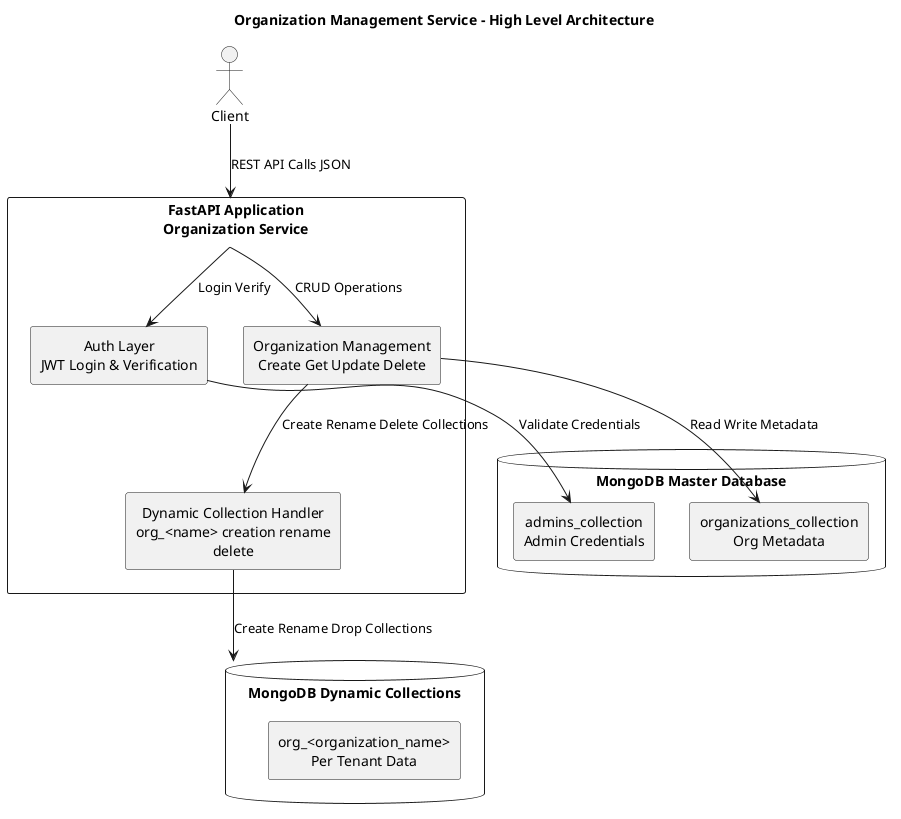

# Organization-Management-Service

### Project Overview

A FastAPI service that manages organizations in a multi‑tenant style using MongoDB.  
**Key features**: create organizations with dynamic per‑tenant collections, admin user management with hashed passwords, JWT authentication, update and delete operations that handle collection lifecycle, and a master metadata store.

---

### Instructions to Run

#### Prerequisites
- **Python 3.10+**
- **MongoDB** running locally or accessible via URI
- Virtual environment recommended

#### Setup and install
```bash
# create and activate virtualenv
python -m venv .venv
source .venv/bin/activate

# install dependencies
pip install -r requirements.txt
```

#### Environment
Create a `.env` file in the project root or edit the configuration in `app/config.py`:
```
MONGO_URI=mongodb://localhost:27017
MASTER_DB_NAME=master_db
JWT_SECRET=your-very-long-secret
JWT_ALGORITHM=HS256
JWT_EXP_MINUTES=60
```

#### Run the app
```bash
# development server
uvicorn app.main:app --reload
```
(make sure MongoDB is also running in the background.)

#### Quick test commands
```bash
# create organization
curl -X POST http://127.0.0.1:8000/org/create \
  -H "Content-Type: application/json" \
  -d '{"organization_name":"freshorg1","email":"freshadmin@test.com","password":"123"}'

# admin login
curl -X POST http://127.0.0.1:8000/admin/login \
  -H "Content-Type: application/json" \
  -d '{"email":"freshadmin@test.com","password":"123"}'
```

---

### API Endpoints

- **POST /org/create**  
  **Input**: `organization_name`, `email`, `password`  
  **Behavior**: validate uniqueness, create `org_<name>` collection, create admin, store metadata.

- **GET /org/{organization_name}**  
  **Input**: path `organization_name`  
  **Behavior**: return organization metadata from master DB.

- **PUT /org/{organization_name}**  
  **Input**: body may include `organization_name`, `admin_email`, `admin_password`  
  **Behavior**: rename collection if org name changes, update admin fields, update metadata.

- **DELETE /org/{organization_name}**  
  **Input**: path `organization_name`  
  **Behavior**: drop dynamic collection, delete admin, delete metadata. Intended to be protected by JWT so only the org admin can delete.

- **POST /admin/login**  
  **Input**: `email`, `password`  
  **Behavior**: verify credentials, return JWT containing `admin_id`, `org_id`, `org_name`, and expiry.

---

### High Level Diagram

Use this PlantUML code to render the architecture diagram:



---

### Design Choices and Trade offs

**Why this design**  
- **Master metadata store** centralizes organization and admin information for easy management.  
- **Per‑tenant collections** (`org_<name>`) provide strong data isolation, simple backups, and straightforward deletion or migration of a single tenant.  
- **FastAPI** gives an async, lightweight, and testable framework suitable for microservices.  
- **MongoDB** offers flexible schema and easy dynamic collection creation.  
- **JWT** provides stateless authentication that scales horizontally.

**Trade offs**  
- **Many collections at scale**: thousands of tenants means many collections, which increases operational overhead and index management complexity.  
- **Cross‑tenant analytics**: splitting data across collections makes global aggregation harder; a shared collection with `org_id` simplifies analytics.  
- **Schema evolution**: changing schema or adding indexes requires applying changes across many collections.  
- **Token invalidation**: JWTs are stateless; revoking tokens requires additional infrastructure.

**Alternative approaches**  
- **Shared collections with org_id** for easier analytics and simpler schema migrations.  
- **Hybrid model** where small tenants share collections and large tenants get dedicated collections or databases.  
- **Per‑tenant databases** for strict isolation and compliance at higher operational cost.

---

### Next Steps and Notes

- **Protect update and delete endpoints** with a dependency that decodes JWT and verifies the requesting admin matches the org admin.  
- **Add tests** for create, update, delete, and auth flows.  
- **Add migration scripts** for schema changes across tenant collections.  
- **Document deployment** steps and environment variables in the repository README.

---
